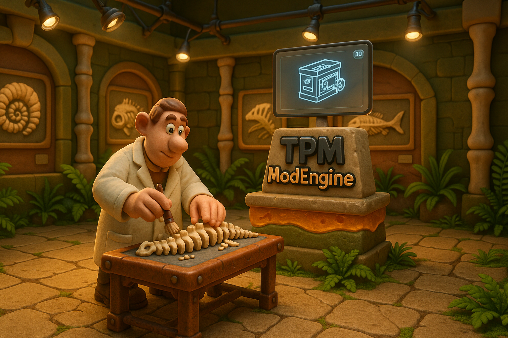
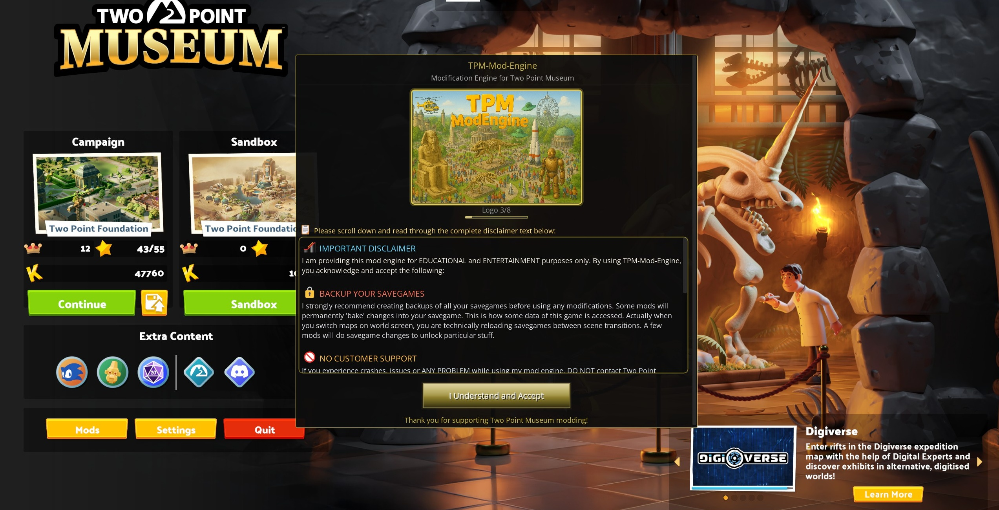
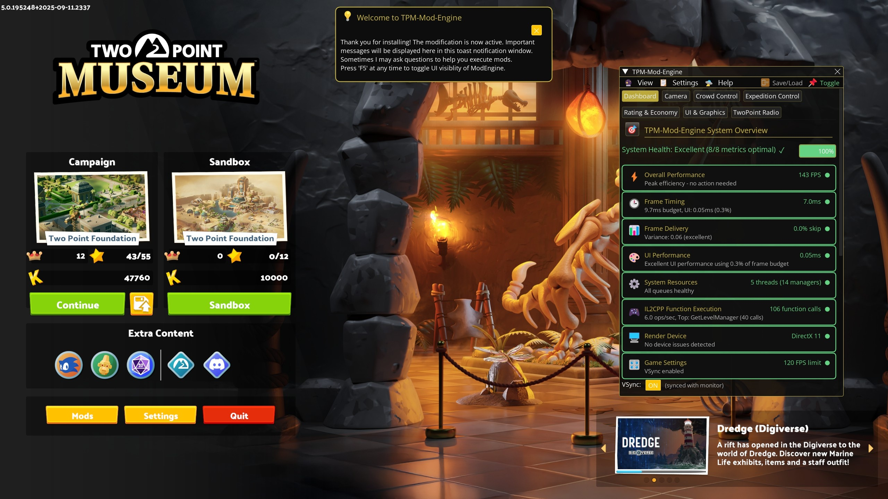
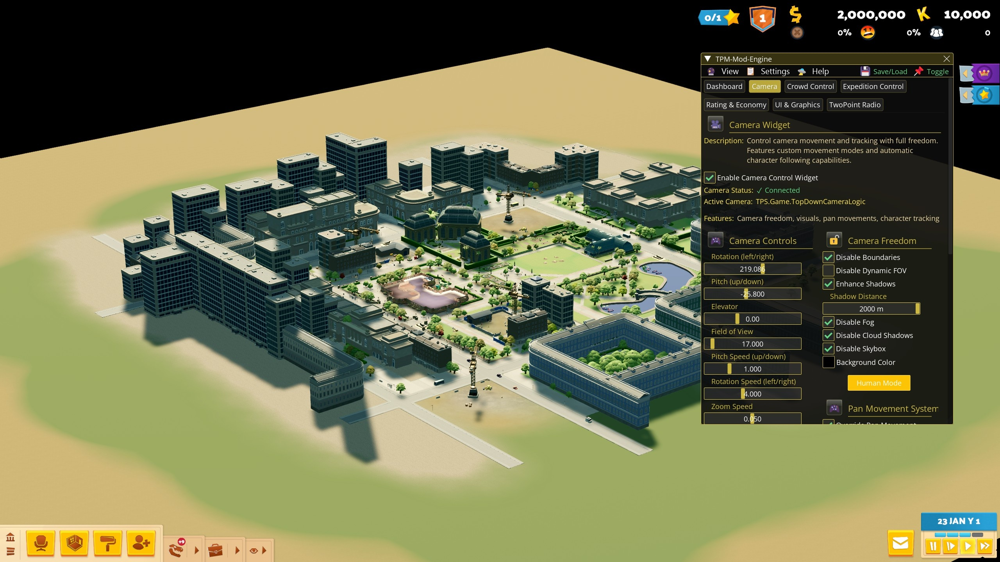
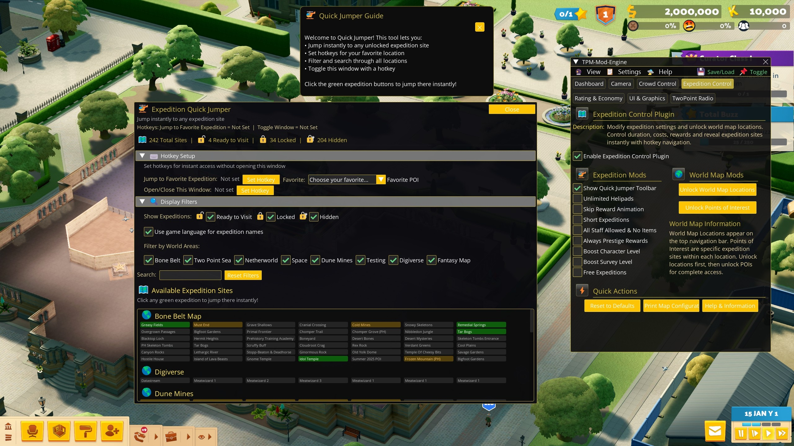
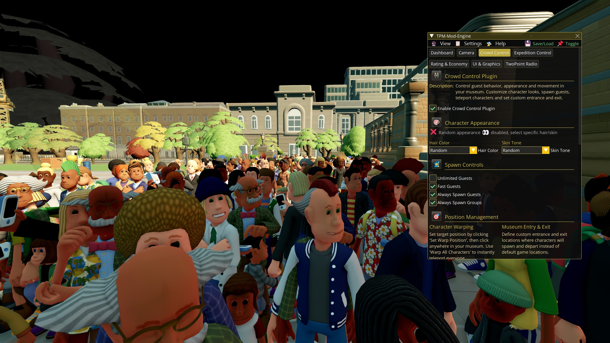
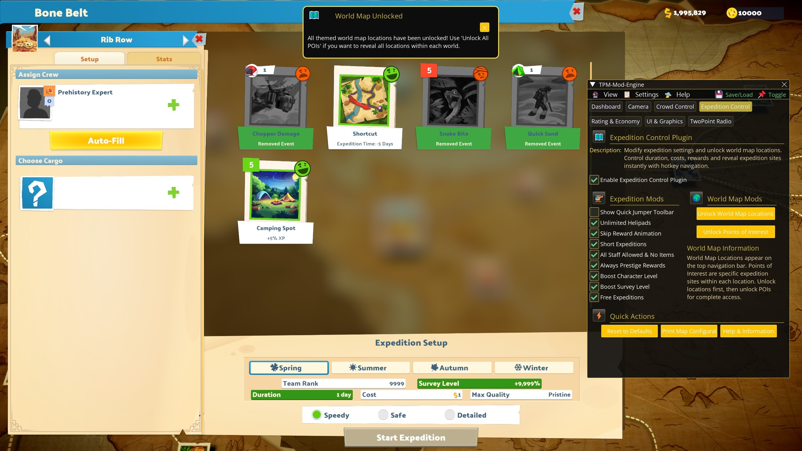
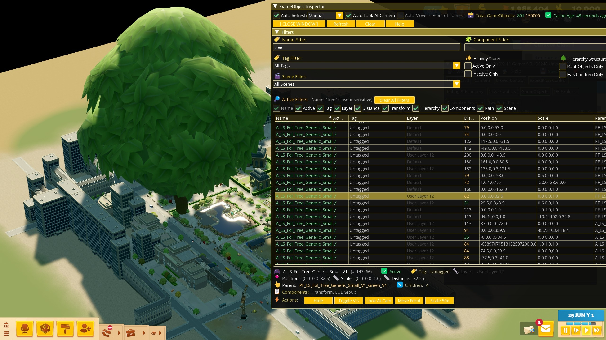

# TPM-Mod-Engine

**FOR RESEARCH AND EDUCATIONAL PURPOSES ONLY**

- No game modification will unlock anything which is not available to you already (e.g. no DLC unlocks)
- No game modification will unlock anything related to Steam (e.g. no steam unlocks)
- No game modification will unlock anything which potentially causes problems (e.g. no no editor unlocks)
- No conflicts with Steam
- Safe to use online (no multiplayer cheating)
- Works with any existing savegame
- Optimized for smooth gameplay at 60-144 FPS with minimal impact on game performance
- Works with both DirectX 11 and 12

Compatible with Two Point Museum Version: **5.0.197724**

## Screenshots
      

## Showcase Video

[Youtube Link](https://www.youtube.com/watch?v=fe-lcr3dzsQ)

## Installation

1. **[Download](https://github.com/coding-dex/TPM-Mod-Engine/releases/download/release/TPM-Mod-Engine-v1.1.zip) TPM-Mod-Engine**
   
2. **Extract archive and copy both files winhttp.dll and TPM-Mod-Engine.dll to your Two Point Museum Steam game folder usually located at: C:\Steam\steamapps\common\Two Point Museum**
   
3. **Start Two Point Museum** through Steam or by running TPM.exe

TPM-Mod-Engine will load automatically once Two Point Museum is running. Always backup your savegames first before using any modification.

## Uninstall

To remove the mod simply delete the files **winhttp.dll** and **TPM-Mod-Engine.dll** from your Two Point Museum Steam game folder.
   
## FAQ

1. **Game does not start anymore and network connection error page is shown**

Solution: Uninstall, start game normally to trigger Steam Cloud sync, close Game, install mod again. Cloud Sync is now functional.

2. **Sometimes input is not responding when clicking on overlay UI**

Solution: Use mouse wheel or ALT+TAB to fix input focus when being unable to click on overlay UI. Known bug with input focus restoration.

3. **I can not use the keys W,A,S,D to move the camera when walking on floor using Human Camera Mode**

Solution: These are built-in hotkeys from the game. Make sure you have configured camera hotkeys in Settings menu from game. These camera hotkeys can then be used in FPS camera mode for better camera control.

4. **Why need winhttp.dll**

Solution: It is the same technique (DLL Proxy) used by [BepInEx](https://github.com/BepInEx/BepInEx), [MelonLoader](https://github.com/LavaGang/MelonLoader) and [UnityDoorstop](https://github.com/NeighTools/UnityDoorstop) to load Unity mods. It is used to the load the actual game modification **TPM-Mod-Engine.dll** and does not require an executable as loader.
TPM-Mod-Engine does not have any 3rd party dependencies, everything is written from scratch. Hence no BepInEx, MelonLoader or UnityDoorstop is required to install the mod.

## In-Game Controls

- F5 - Show/Hide main control panel
- F8 - Toggle compact toolbar mode

# Changelog

**Version 1.1**
Updated for Two Point Museum Version: 5.0.197724 - no further changes

**Version 1.0**
First public release for Two Point Museum Version: 5.0.195248

## CORE ENGINE FEATURES

- Toast notification system with user guidance to help with game mods
- Quick 5-second save/load functionality
- Custom loading screens
- All user preferences remembered in config file
- 4 visual Themes with opacity control
- Performance monitor with real-time FPS display and frame analysis
- UI with high-DPI scaling and custom emoji fonts

### [ PLUGIN: Camera ]

- Remove all camera boundary restrictions
- Zoom anywhere with unlimited distance
- 360° rotation with full pitch control
- Real-time height adjustment for perfect shots
- FOV Control: Adjust field of view (10° to 120°) for cinematic shots
- Custom selfwritten new pan movement modes: Drag mode, go-kart mode with optional focalpoint fixation
- Speed Controls: Customize zoom, pitch and rotation speeds independently
- Automatic Camera Movement: First-Person View: Follow behind any guest or staff member
- Automatic Camera Movement: Orbit Modes: Side-by-side or documentary-style cinematic movement
- Automatic Camera Movement: Human Mode: Ground-level exploration with 75° FOV default
- Height Control: Precise control tracking height (0.1m to 2.0m) during automatic camera movement
- Extended Shadows: Adjust distance (400m to 3000m, default 2000m)
- Fog Control: Complete fog and cloud shadow removal
- Custom Backgrounds: Replace skybox with solid colors using color picker
- Multi-Camera Support: TopDown, LevelSelect and Expedition cameras

### [ PLUGIN: Crowd Control ]

- Remove Spawn Limits: Support up to 3,500 guests safely (performance optimized)
- Continuous Arrivals: Force non-stop guest spawning at entrance
- Group Spawning: Enable continuous family and friend group arrivals
- Speed Enhancement: Make all guests walk faster throughout museum
- Hair Color Control: Set specific colors for all new characters (6 options)
- Skin Tone Selection: Choose tones for consistent character themes (10 options)
- Click-to-Set Positioning: Interactive warp point placement
- Mass Teleportation: Move all characters to selected position instantly
- Custom Museum Entrance: Click-to-set where new guests spawn
- Custom Museum Exit: Define where characters leave your museum
- Force Stay System: Prevent guests from leaving with specific reasons
- Custom Send Home: Send guests home with specific reasons
- Live Monitoring: Real-time guest, staff and visitor counts

### [ PLUGIN: Expedition Control ]

- 1-Day Completion: All expeditions finish in 1 day
- Guaranteed Prestige: Every expedition returns highest quality rewards
- Staff Freedom: Send any staff on any expedition (ignore requirements)
- Free Launch: Remove all expedition costs
- Animation Skip: Auto-skip reward box opening sequences
- Instant Staff Leveling: Boost returning staff to level 19 immediately
- Survey Boost: Reach maximum survey level after single expedition
- Unlimited Helipads: Remove helipad construction limits
- Complete Map Unlock: Reveal all world themed locations
- POI Revelation: Unlock all Points of Interest and expedition sites
- World Location Access: Immediate access to all major expedition areas
- Floating POI Window: Compact toolbar showing all expedition locations
- Instant Travel: Click any POI to jump directly there with smooth fade
- Smart Organization: POIs grouped by world location with status indicators
- Real-Time Search: Find specific POIs by name with live filtering
- Hotkey System: Set custom hotkeys for instant travel

### [ PLUGIN: Rating & Economy ]

- Museum Level 200: Jump to maximum level instantly (permanent, requires save/reload)
- Act 63 Completion: Advance to final act immediately (permanent, requires save/reload)
- Perfect Ratings: Lock all statistics at 100%
- Maximum Satisfaction: Force all needs to 100% permanently
- Control: Happiness, energy, hunger, thirst, toilet, environment
- Custom Input Control: Set any amount up to $999,999,999 with validation
- Custom Kudosh Input: Add any amount up to 999,999 points
- Speed Multiplier: Adjust fish reproduction (0.1x to 100x normal speed)

### [ PLUGIN: Performance & Display ]

- Character Status Icons: Toggle all guest/staff status indicators
- Character Display: Hide/show all characters for clean screenshots
- Complete HUD Toggle: Show/hide entire user interface overlay
- FPS Control: Set custom frame rate limits or unlimited performance
- Unity 60 FPS Detection: Automatic detection and warnings
- VSync Control: Enable/disable vertical synchronization independently
- Speed Range: Adjust simulation (0.1x slow motion to 100x time warp)
- Render Scale: Internal resolution scaling (0.5x to 4.0x for supersampling)
- LOD Distance Control: Level of Detail switching (0.1x to 4.0x range)
- Visual Effects Integration: Enhanced shadows, fog, and cloud control

### [ PLUGIN: TwoPoint Radio ]
- Playback Controls: Stop, Resume, Skip, and Next track functionality
- Live Status Display: See currently playing track and active DJ show
- Instant Playback: Click any song to play immediately
- Track Information: Full song titles and artist information displayed
- DJ Selection: Choose specific DJs and their unique shows
- Show Browsing: Expand any DJ to see their complete show catalog

### [ PLUGIN: GameObjects ]
Real-time Unity GameObject inspection and manipulation system

### [ PLUGIN: DB Explorer ]
Game database exploration and analysis system

### [ PLUGIN: Assembly Plugin ]
IL2CPP assembly code analysis toolkit

**FOR RESEARCH AND EDUCATIONAL PURPOSES ONLY**
